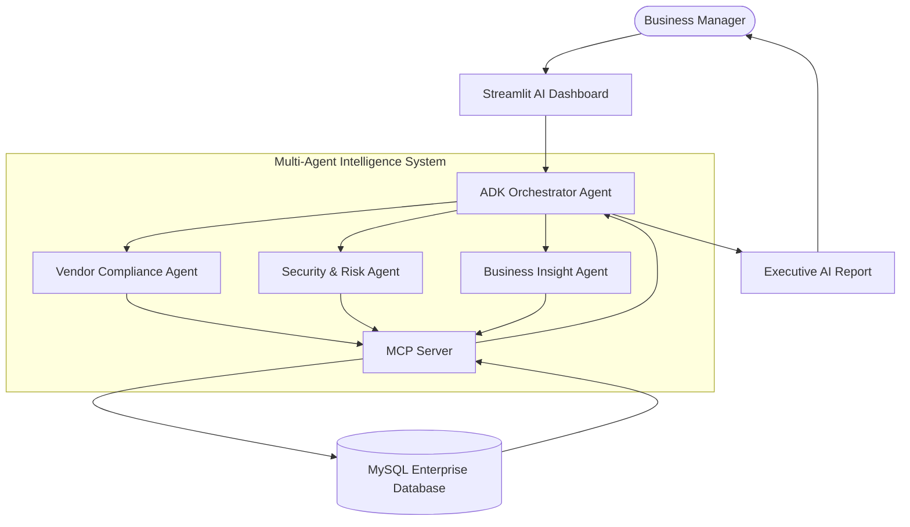

# 🌱 EcoChain AI

## Autonomous Sustainable Supply Chain Intelligence & Vendor Compliance Agent

### 🏆 Kaggle AI Agents: Intensive Vibe Coding Capstone Project with Google

EcoChain AI is an enterprise-grade **multi-agent AI system** that transforms traditional supply chain auditing into an autonomous intelligence workflow.

Using **Google Gemini, Agent Development Kit (ADK), Model Context Protocol (MCP), and secure AI guardrails**, EcoChain AI analyzes vendor documents, evaluates sustainability, detects risks, and generates actionable business decisions automatically.

---


# 🚨 Problem Statement

Modern enterprises collaborate with thousands of suppliers.

Every supplier requires continuous evaluation:

* Invoice accuracy
* Tax compliance
* Sustainability score
* Carbon footprint
* Financial risk
* Operational efficiency

Traditional manual auditing creates:

❌ Slow decision making
❌ High operational cost
❌ Human errors
❌ Poor scalability

Companies need an AI system that can continuously monitor vendors and recommend smarter business actions.

---

# 💡 Our Solution

EcoChain AI introduces an autonomous **AI-powered supply chain intelligence platform**.

Instead of using one general AI model, EcoChain AI uses multiple specialized agents working together.

Each agent has a dedicated responsibility:

* Compliance analysis
* Security protection
* Business optimization

The result:

A complete AI-driven vendor intelligence system.

---

# 🏗️ System Architecture



---

# 🤖 Multi-Agent System

## 🧠 ADK Orchestrator Agent

The central intelligence controller.

Responsibilities:

* Understand user requests
* Plan execution workflow
* Delegate tasks
* Combine multiple agent outputs

Example:

```
User:

Analyze Vendor ABC


Orchestrator:

→ Compliance Check

→ Security Validation

→ Business Recommendation


Final Executive Report

```

---

# 📊 Vendor Compliance Agent

Responsible for vendor intelligence.

Capabilities:

✅ Invoice analysis
✅ PDF/CSV processing
✅ Compliance scoring
✅ Carbon evaluation
✅ Vendor ranking

Technology:

* PyMuPDF
* Pandas
* Gemini reasoning

Example:

```
Vendor:
EcoPaper Corp


Compliance:
94%


Risk:
LOW


Recommendation:
Continue Partnership

```

---

# 🔐 Security & Risk Agent

Enterprise AI requires protection.

EcoChain AI includes:

## PII Protection Layer

Sensitive information is sanitized before AI processing.

Example:

Before:

```
Bank Account:
1234567890
```

After:

```
XXXXXX7890
```

---

## AI Guardrails

Protection against:

* Prompt injection attacks
* Confidential information leakage
* Unsafe AI outputs

Security workflow:

```
Input

 ↓

PII Masking

 ↓

AI Processing

 ↓

Output Validation

 ↓

Safe Response

```

---

# 📈 Business Insight Agent

Converts analysis into business strategy.

Generates:

* Vendor comparison
* Cost reduction opportunities
* ROI analysis
* Sustainability recommendations

Example:

```
Recommendation:

Switching logistics provider may reduce
annual cost by 15%

```

---

# 🔗 MCP Server Architecture

The **Model Context Protocol (MCP)** server works as a secure bridge between AI agents and enterprise data.

Architecture:

```
AI Agents

    |

 MCP Tools

    |

 Database Layer

    |

 MySQL

```

Implemented Tools:

| MCP Tool             | Purpose                 |
| -------------------- | ----------------------- |
| fetch_vendor         | Retrieve vendor profile |
| fetch_vendor_history | Access audit records    |
| fetch_invoices       | Analyze financial data  |
| compute_risk_score   | Calculate vendor risk   |

---

# 🛡️ Security Features

## PII Masking

Protects:

* Bank information
* Personal identifiers
* Sensitive company data

## Input Guardrails

Detects:

* Malicious prompts
* Instruction manipulation

## Output Validation

Prevents:

* Confidential information exposure
* Unsafe responses

---

# 🧩 Technology Stack

## Artificial Intelligence

* Google Gemini
* Google Agent Development Kit (ADK)

## Backend

* Python

## Agent Communication

* MCP Server

## Database

* MySQL

## Interface

* Streamlit

---

# 📂 Project Structure

```
EcoChain-AI/


│
├── agents/

│   ├── orchestrator.py

│   ├── vendor_agent.py

│   ├── security_agent.py

│   └── insight_agent.py


│
├── mcp_server/

│   ├── server.py

│   ├── database.py

│   └── tools.py


│
├── security/

│   ├── pii_mask.py

│   └── guardrails.py


│
├── database/

│   └── schema.sql


│
├── app.py

├── requirements.txt

└── README.md

```

---

# ⚙️ Installation

Clone repository:

```bash
git clone https://github.com/sayansarkar3504-cmd/EcoChain-AI.git
```

Move into project:

```bash
cd EcoChain-AI
```

Create environment:

```bash
python -m venv venv
```

Activate:

Windows:

```bash
venv\Scripts\activate
```

Install dependencies:

```bash
pip install -r requirements.txt
```

---

# 🔑 Environment Setup

Create:

```
.env
```

Add:

```
GEMINI_API_KEY=

MYSQL_HOST=

MYSQL_USER=

MYSQL_PASSWORD=

MYSQL_DATABASE=

```

Never expose API keys publicly.

---

# 🗄️ Database Setup

Create database:

```sql
CREATE DATABASE ecochain_db;
```

Run:

```bash
mysql -u root -p < database/schema.sql
```

---

# ▶️ Running Demo

Start MCP Server:

```bash
python mcp_server/server.py
```

Start Dashboard:

```bash
streamlit run app.py
```

Open:

```
http://localhost:8501
```

---

# 🎬 Demo Workflow

1. Upload vendor CSV/PDF invoice

2. Select vendor

3. Click:

```
Analyze Vendor
```

4. AI agents collaborate:

```
User

 ↓

ADK Orchestrator

 ↓

Vendor Agent

 ↓

Security Agent

 ↓

Insight Agent

 ↓

Executive Report

```

5. View:

✅ Compliance Score
✅ Risk Status
✅ Sustainability Analysis
✅ AI Recommendations

---

# 🌍 Real-World Impact

EcoChain AI helps organizations:

* Reduce manual auditing workload
* Improve supplier transparency
* Detect vendor risks earlier
* Build sustainable supply chains
* Make data-driven decisions

---

# 🔮 Future Roadmap

Future improvements:

* Human approval workflows
* Enterprise authentication
* Real-time supplier monitoring
* Automated vendor communication
* Advanced agent collaboration

---

# ⭐ Project Highlights

This project demonstrates:

✅ Multi-Agent AI Architecture
✅ Google ADK Implementation
✅ MCP Server Integration
✅ Secure AI Workflow
✅ Enterprise Business Use Case
✅ Real-world Sustainability Impact

---

Built for:

**Kaggle AI Agents: Intensive Vibe Coding Capstone Project with Google**

Powered by:

**Gemini • ADK • MCP • Streamlit • MySQL**
